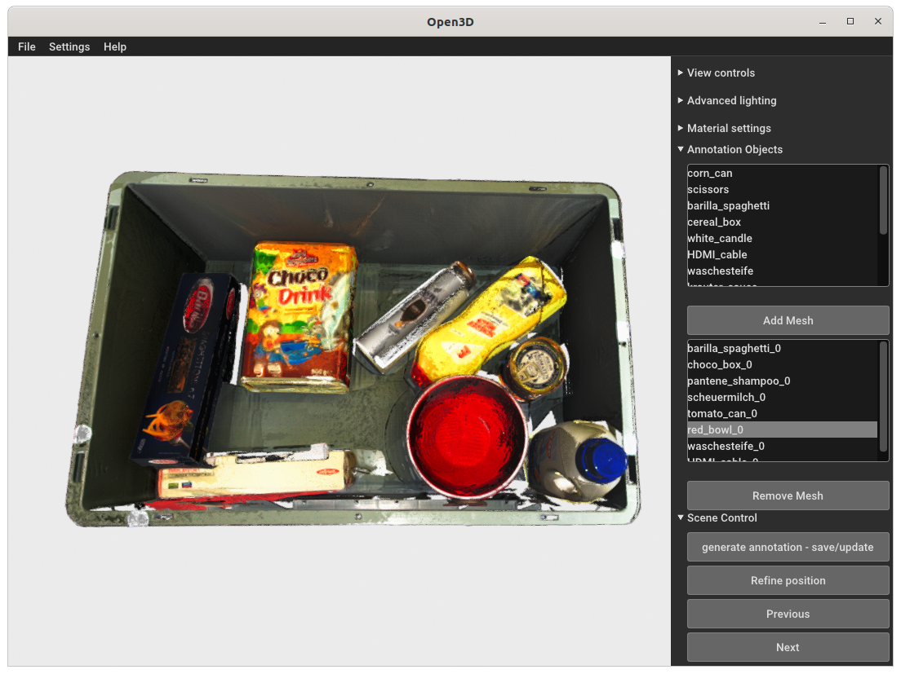

# 3D Annotation Tool for [ML2R](https://www.ml2r.de/) segmentation and pose estimation real dataset
This tool is used for the annotation of the 3D point cloud scenes of [This dataset](https://github.com/FLW-TUDO/klt_dataset_collector).
The dataset generates 3D segmentation data, 2D segmentation masks and 6D pose for each sample in each scene in the dataset.
The tool uses open3D library for both the processing and the gui. The tool can be easily and quickly changed to do the same annotation for other 3D datasets.

