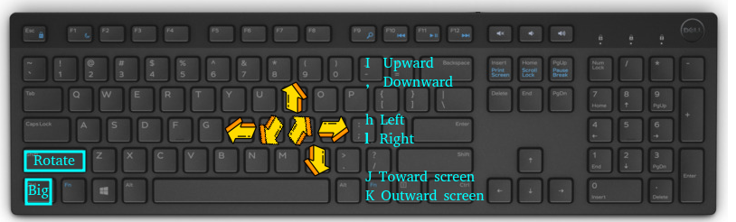

# DoPose tool for 6D pose annotation in BOP format


This tool can be used to annotate object's 6D pose in [BOP format](https://github.com/thodan/bop_toolkit/blob/master/docs/bop_datasets_format.md).
The tool was used for the creation of [DoPose dataset](https://zenodo.org/record/6103779).

The tool uses open3D library for both the processing and the gui. The tool can be easily and quickly changed to do the same annotation for other 3D datasets and point clouds.

After annotating your dataset with the tool, use [The BOP toolkit](https://github.com/thodan/bop_toolkit) to generate 2D segmentation mask images and COCO json annotations if needed.

## Interface:
I, jk hl  are used to control direction

Translation/rotation mode:
- Shift not clicked: translation mode
- Shift clicked: rotation model

Distance/angle big or small:
- Ctrl not cliked: small distance(1mm) / angle(2deg)
- Ctrl clicked: big distance(5cm) / angle(90deg)

R or "Refine" button will call ICP algorithm to do local refinement of the annotation (see GIF above to see effect).

## running the tool
```
python tool-gui.py --start-scene_num START_SCENE_NUM --start-image_num START_IMAGE_NUM DATASET-PATH DATASET-SPLIT
```




